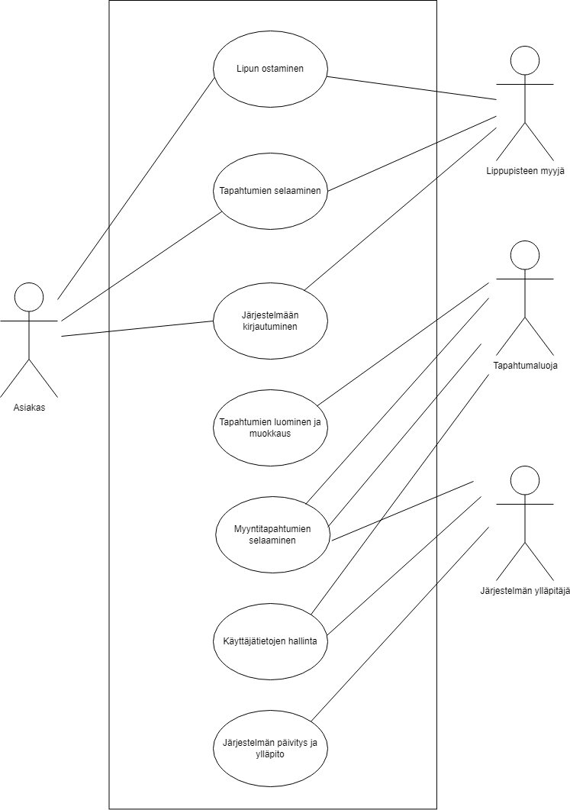

# *Projektin nimi*

Tiimi: Satu Kulta, Ville Pajukangas, Ali Romar, Tuukka Teilas

## *Johdanto*

TicketGuru on lipunmyyntijärjestelmä, jonka tilaajana toimii lipputoimisto. Järjestelmä mahdollistaa lipunmyynnin myyntipisteessä, jossa lipppupisteen myyjä voi myydä ja tulostaa liput asiakkaille. Järjestelmän avulla toimisto voi määritellä myytävät tapahtumat ja hallita sekä seurata lippujen myyntiä. Alustavasti järjestelmä tarjoaa lippujen myynnin myyntipisteessä, ja ennakkomyynnin päättyessä loput liput tulostetaan myytäväksi ovella. Tulostettavassa lipussa on skannattava tarkastuskoodi, joka helpottaa lippujen tarkastusta ovella.

*Asiakas* on lipputoimisto, ja järjestelmän tarkoitus on vastata heidän tarpeisiinsa lipunmyynnissä ja tapahtumien hallinnassa. Jatkokehityksen suunnitelmissa on verkkokauppa, josta lipputoimiston asiakkaat voivat itse ostaa lippuja.

Järjestelmän palvelinpuolen toiminnot toteutetaan Javalla Spring Boot -kehystä käyttäen. Tämä valinta mahdollistaa tehokkaan ja joustavan palvelimen toiminnallisuuden rakentamisen, joka tukee tarvittavia REST-palveluita ja tietokantatoiminnallisuuksia. Tietokantana käytetään MariaDb:tä.

Käyttöliittymä on selainpohjainen React-sovellus, joka tarjoaa nykyaikaisen ja responsiivisen käyttökokemuksen. 

## *Järjestelmän määrittely*

*Määrittelyssä järjestelmää tarkastellaan käyttäjän näkökulmasta. Järjestelmän
toiminnot hahmotellaan käyttötapausten tai käyttäjätarinoiden kautta, ja kuvataan järjestelmän
käyttäjäryhmät.*

### Käyttäjäryhmät
*-   Lyhyt kuvaus käyttäjäryhmistä (rooleista)*

- Lippupisteen myyjä
    - Fyysisessä lipunmyyntipisteessä työskentelevä henkilö, joka käyttää lipunmyyntijärjestelmän myyntipuolta etäyhteydellä erillisen päätelaitteen avulla.

- Tapahtumaluoja/"toimisto"?
    - Yrityksen sisäinen, toimistolla tai etänä työskentelevä käyttäjä, joka pystyy luomaan lipunmyyntijärjestelmään uusia tapahtumia ja määrittelemään niiden tiedot.

- Järjestelmän ylläpitäjä
    - Yrityksen sisäinen tai ulkopuolinen henkilö, joka ylläpitää järjestelmän toimivuutta ja mahdollisesti päivittää sitä.

- Verkkokauppa asiakas
    - Yrityksen ulkopuolinen henkilö, joka haluaa ostaa lipun tai lippuja yhteen tai useampaan tapahtumaan verkkokaupan kautta. **Tämä rooli on luotu jatkokehitystä ajatellen, kun järjestelmään lisätään verkkokauppa.**

### *Käyttötapauskaavio*
-   *Käyttäjäroolit ja roolien tarvitsemat toiminnot, esim. käyttötapauskaaviona
    (use case diagram) tai käyttäjätarinoina.*

### *Käyttötapauskuvaukset*
-   *Lyhyt kuvaus käyttötapauksista tai käyttäjätarinat*

### *Käyttäjätarinat*

*Kuvauksissa kannattaa harkita, mikä on toteuttajalle ja asiakkaalle oleellista
tietoa ja keskittyä siihen.*

- Asiakkaana haluan, että saan ostettua lipun haluamaani tapahtumaan sujuvasti, koska olen laatuun ja helppouteen tottunut ihminen.

- Lipunmyyjänä haluan, että myyntijärjestelmä vastaa nopeasti, jotta saan myyntitapahtuman suoritettua tehokkaasti.

- Lipunmyyjänä haluan, että myyntijärjestelmä on yksinkertainen, jotta se on helppo kouluttaa uusille työntekijöille.

- Tapahtumien hallinnoijana haluan pystyä määrittelemään eri käyttäjäryhmille eri hintaisia lippuja, jotta voimme kohdentaa markkinointia.

- Markkinointijohtajana haluan pystyä tulostamaan myyntiraportteja, jotta voin käyttää tätä dataa tulevien tapahtumien suunnitteluun.

- Tapahtumien luojana haluan pystyä määrittämään tapahtumalleni ajan, paikan, kuvauksen sekä lippujen määrät lipputyypeittäin, koska näitä tietoja tarvitaan tapahtumaa markkinoidessa.

## *Käyttöliittymä*

Ylläolevassa kaaviossa on kuvattu lipunmyyntijärjestelmän navigointi. Itse navipalkki vielä tästä versiosta puuttuu kokonaan. Se tullaa lisäämään projektin edetessä. Kaaviosta löytyvien kuvien perusteella kaikille applikaation sivuille on pääsy paitsi lippujen myynti sivuille. Tämä hoidettaisiin juurikin edellä mainitulla yläpalkilla. 

## *Tietokanta*

*Järjestelmään säilöttävä ja siinä käsiteltävät tiedot ja niiden väliset suhteet
kuvataan käsitekaaviolla. Käsitemalliin sisältyy myös taulujen välisten viiteyhteyksien ja avainten
määritykset. Tietokanta kuvataan käyttäen jotain kuvausmenetelmää, joko ER-kaaviota ja UML-luokkakaaviota.*

*Lisäksi kukin järjestelmän tietoelementti ja sen attribuutit kuvataan
tietohakemistossa. Tietohakemisto tarkoittaa yksinkertaisesti vain jokaisen elementin (taulun) ja niiden
attribuuttien (kentät/sarakkeet) listausta ja lyhyttä kuvausta esim. tähän tyyliin:*

> ### _Tilit_
> _Tilit-taulu sisältää käyttäjätilit. Käyttäjällä voi olla monta tiliä. Tili kuuluu aina vain yhdelle käyttäjälle._
>
> Kenttä | Tyyppi | Kuvaus
> ------ | ------ | ------
> id | int PK | Tilin id
> nimimerkki | varchar(30) |  Tilin nimimerkki
> avatar | int FK | Tilin avatar, viittaus [avatar](#Avatar)-tauluun
> kayttaja | int FK | Viittaus käyttäjään [käyttäjä](#Kayttaja)-taulussa

## *Tekninen kuvaus*

*Teknisessä kuvauksessa esitetään järjestelmän toteutuksen suunnittelussa tehdyt tekniset
ratkaisut, esim.*

-   *Missä mikäkin järjestelmän komponentti ajetaan (tietokone, palvelinohjelma)
    ja komponenttien väliset yhteydet (vaikkapa tähän tyyliin:
    https://security.ufl.edu/it-workers/risk-assessment/creating-an-information-systemdata-flow-diagram/)*
-   *Palvelintoteutuksen yleiskuvaus: teknologiat, deployment-ratkaisut yms.*
-   *Keskeisten rajapintojen kuvaukset, esimerkit REST-rajapinta. Tarvittaessa voidaan rajapinnan käyttöä täsmentää
    UML-sekvenssikaavioilla.*
-   *Toteutuksen yleisiä ratkaisuja, esim. turvallisuus.*

*Tämän lisäksi*

-   *ohjelmakoodin tulee olla kommentoitua*
-   *luokkien, metodien ja muuttujien tulee olla kuvaavasti nimettyjä ja noudattaa
    johdonmukaisia nimeämiskäytäntöjä*
-   *ohjelmiston pitää olla organisoitu komponentteihin niin, että turhalta toistolta
    vältytään*

## *Testaus*

*Tässä kohdin selvitetään, miten ohjelmiston oikea toiminta varmistetaan
testaamalla projektin aikana: millaisia testauksia tehdään ja missä vaiheessa.
Testauksen tarkemmat sisällöt ja testisuoritusten tulosten raportit kirjataan
erillisiin dokumentteihin.*

*Tänne kirjataan myös lopuksi järjestelmän tunnetut ongelmat, joita ei ole korjattu.*

## *Asennustiedot*

*Järjestelmän asennus on syytä dokumentoida kahdesta näkökulmasta:*

-   *järjestelmän kehitysympäristö: miten järjestelmän kehitysympäristön saisi
    rakennettua johonkin toiseen koneeseen*

-   *järjestelmän asentaminen tuotantoympäristöön: miten järjestelmän saisi
    asennettua johonkin uuteen ympäristöön.*

*Asennusohjeesta tulisi ainakin käydä ilmi, miten käytettävä tietokanta ja
käyttäjät tulee ohjelmistoa asentaessa määritellä (käytettävä tietokanta,
käyttäjätunnus, salasana, tietokannan luonti yms.).*

## *Käynnistys- ja käyttöohje*

*Tyypillisesti tässä riittää kertoa ohjelman käynnistykseen tarvittava URL sekä
mahdolliset kirjautumiseen tarvittavat tunnukset. Jos järjestelmän
käynnistämiseen tai käyttöön liittyy joitain muita toimenpiteitä tai toimintajärjestykseen liittyviä asioita, nekin kerrotaan tässä yhteydessä.*

*Usko tai älä, tulet tarvitsemaan tätä itsekin, kun tauon jälkeen palaat
järjestelmän pariin !*