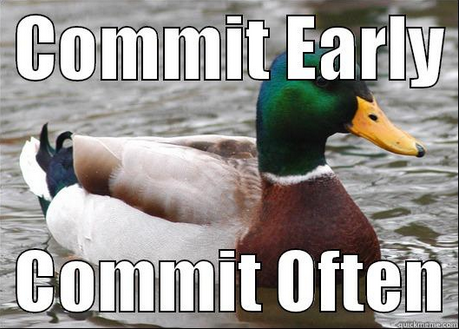

# ReadMe - yleistä tietoa ja ohjeita repon käytänteistä

Tähän markdown tiedostoon yritetään kerätä ohjeita ja luoda yhteisiä käytänteitä. Tätä saa päivitellä vapaasti kun on aikaa/jaksamista.  

## Scrum Boardin käyttö

Scrum Board löytyy Git Hubista "Projects" välilehdeltä.  
Pyritään pitämään Scrum Board ajan tasalla.  

## Haarojen käytöstä - Branches

Jokaisella on oma nimetty työskentelyhaaransa, jossa tiimin jäsenet työskentelevät, sekä yhteinen dev haara, johon yhdistetään yhteiset tuotokset sprintin aikana. Sprintin päätteeksi dev haara yhdistetään main haaraan, josta työ esitellään sprintin katselmuksessa. Muistakaa päivittää paikallinen dev haaranne usein, varsinkin teette pitkiä sessioita ilman committeja.

### Suositeltu työjärjestys 

*NÄMÄ OHJEET EIVÄT VÄLTTÄMÄTTÄ TOIMI SINULLA JOS ESIMERKIKSI PAIKALLINEN HAARASI EI SEURAA SAMAN NIMISTÄ ETÄREPOSITORION HAARAA TAI OLET TEHNYT MUITA OMANLAISIA MUUTOKSIA*

Kun aloitat työskentelyn paikallisesti varmista ensin, että paikallinen repositoriosi on ajan tasalla. Tämä kannattaa aloittaa siirtymällä dev haaraan komennolla `git checkout dev`, jonka jälkeen komennolla `git fetch` tarkistat onko etärepositorioon tullut uusia päivityksiä. Jos etärepositorio on paikallistasi edellä, lataa uusin tilanne paikalliseen repositorioosi komennolla `git pull` kunkin päivitetyn haaran kohdalla jota seuraat (eli todennäköisesti vain dev).
Tämän jälkeen voit siirtyä paikallisesti omaan työskentelyhaaraasi komennolla `git checkout *oman haarasi nimi*`. Päivitä myös tämä oma paikallinen työskentelyhaarasi yhdistämällä päivitetty paikallinen dev haarasi siihen komennolla `git merge dev`. Paikallinen repositoriosi on nyt ajan tasalla ja voit nyt aloittaa työskentelyn.

Suosittelen suorittelemaan komentoa `git fetch` aina välillä työskentelyn lomassa niin tiedät jos joku muu on tehnyt uusia muutoksia (tai vaihtoehtoisesti käyt katsomassa githubissa).

Kun olet saanut työsi valmiiksi omassa henkilökohtaisessa haarassasi lisää muutokset komennolla `git add .` (=valmistelee kaikki muutokset committia varten). Commitoi muutokset komennolla `git commit` tai vaihtoehtoisesti `git commit -m "Kirjoita tähän commit messagesi"`. Nyt olisi hyvä hetki siirtyä dev haaraan `git checkout dev` (tai puskea oma paikallinen haara etärepon omaan työskentelyhaaraasi `git push`). Varmista vielä `git fetch`, että dev haarasi on ajan tasalla etärepositorion kanssa. Jos näin on niin voit yhdistää paikallisesti työskentelyhaarasi dev haaraan `git merge *oman haarasi nimi*`. Nyt voit puskea päivitetyn dev haarasi etärepositorioon `git push` muiden saataville.
